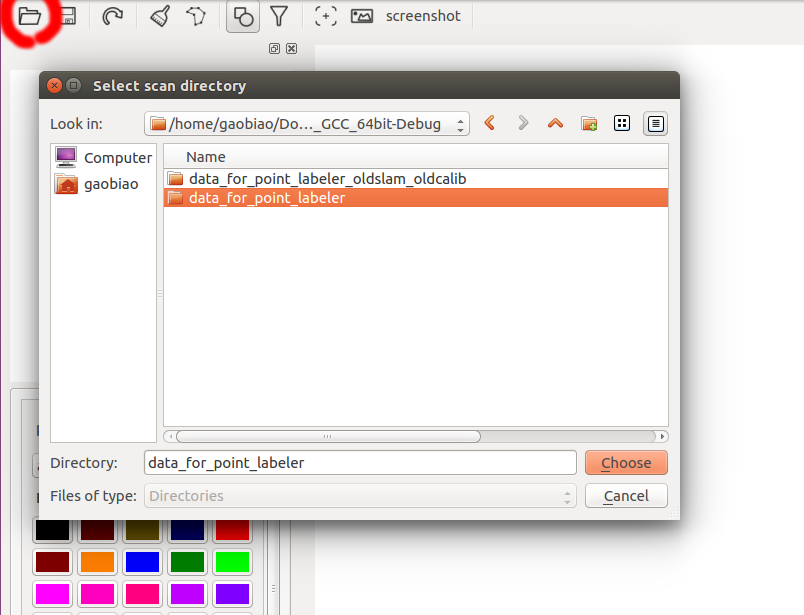

# SemanticPOSS标注流程

## 概述

本标注流程是在range image数据标注的基础上，利用point_labeler工具进行完善标注的过程。


## 标注环境准备 ##

1.  **GenerateSamplesForPointLabeler** : 将基于range image的标注结果，转化成可以被point_labeler读取的数据格式

   ```
   https://github.com/jsgaobiao/Generate_Samples_For_Point_Labeler
   ```

2. **Point Labeler**: SemanticKITTI团队开发的开源点云语义标注工具

   ```
   https://github.com/jbehley/point_labeler
   ```


## 数据准备

1. **dsvl** : 包含点云数据和类别标签的二进制数据格式

2. **transproc.log**: 基于rangeimage的标注结果

3. **calib**: 标定参数文件，默认是P40n.calib

4. **colortable.txt**: 类别标签和可视化颜色的映射表

5. **bbox-all.log**: 数据段中所有instance物体的3D包围框信息（自动生成+少量人工矫正）


## 数据格式转换 ##

1. **编译GenerateSamplesForPointLabeler**

   ```bash
   ./GenerateSamplesForPointLabeler [dsvl] [transproc.log] [calib] [colortable] [output_dir] [bbox] [bbox_overwrite_flag]
   # 第一次转换数据时，bbox_overwrite_flag置1
   # 如果已经用point_labeler工具标注了部分点云，请将已标注的标签存入labels_bak文件夹中，并将bbox_overwrite_flag置0
   ```

   将中括号中的参数替换为对应的内容，说明如下：

   [dsvl](required): 包含点云数据和类别标签的二进制数据格式，例如20190331133302_4-seg.dsvl-timefix
   [transproc.log](required): 基于rangeimage的标注结果，例如20190331133302_4-transproc.log
   [calib](default): 标定参数，默认是P40n.calib
   [colortable](default): 类别标签和可视化颜色的映射表，默认是colortable.txt
   [output_dir](default): 输入数据转换结果的文件夹，默认是data_for_point_labeler
   [bbox](optional): （可选）3d的包围框，数据段中所有instance物体的3D包围框信息（自动生成+少量人工矫正），例如bbx-all.log
   [bbox_overwrite_flag](optional): （可选，和bbox参数同时存在，If bbox is not empty, must have this parameter.）该值为0表示保留labels_bak中的标签信息(labels_bak文件夹默认在output_dir下)，只覆盖包围框中的标签和instance id； 若该值为1则保留transproc中的标签和3d box中的标签和instance id


   **完成上述步骤后，在output_dir中（默认是data_for_point_labeler）应该包括 :**

   (1) 文件夹：labels, tag, velodyne

   (2) 车辆位姿文件 poses.txt

   (3) calib.txt

2. **使用point_labeler程序进行标注**

   打开程序路径(例如/home/gaobiao/catkin_ws_labeler/src/point_labeler/bin) 

   1. **将labels.xml中的内容替换为SemanticPOSS对应的内容**

   2. **修改setting.cfg的设置，建议配置如下：（如果程序崩溃或内存不够，可以将tile size调小）**

      ```
      tile size: 200.0
      max scans: 200
      min range: 2.5
      max range: 60.0
      gpu memory: 4
      ```

   3. **执行标注程序**

   ```
   ./labeler
   ```

   4. **点击左上角，打开数据文件夹**

   5. **视角操作说明**

      |       说明       |                按键                |
      | :--------------: | :--------------------------------: |
      | 移动视角相机位置 |              W,A,S,D               |
      |     缩放视角     |              鼠标滚轮              |
      |   旋转相机视角   |          Ctrl + 鼠标右键           |
      |   升降相机视角   | Ctrl + 鼠标中键 （按住后移动鼠标） |

   6. 操作界面说明

      

      

      

   7. 

