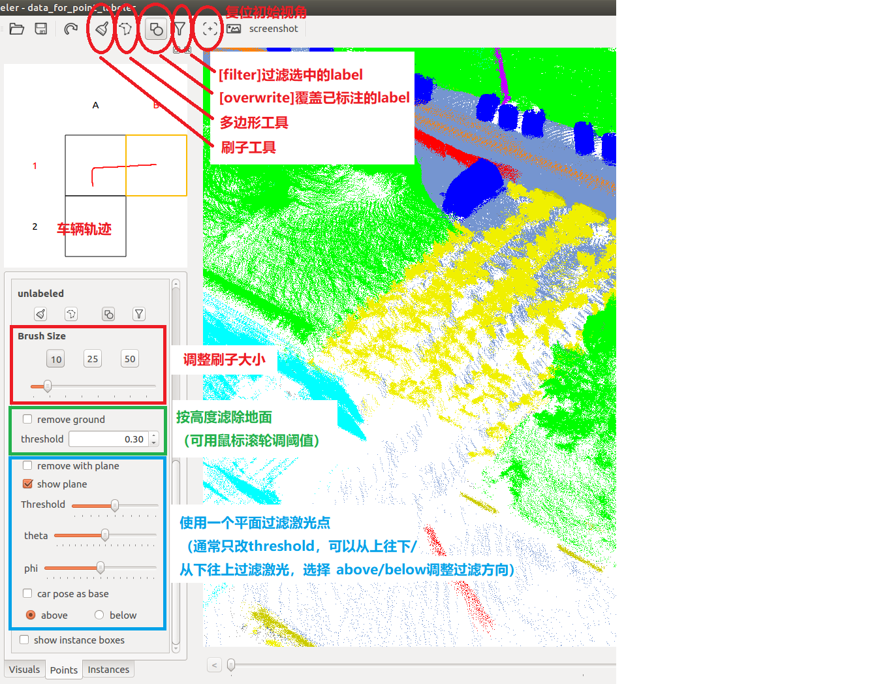
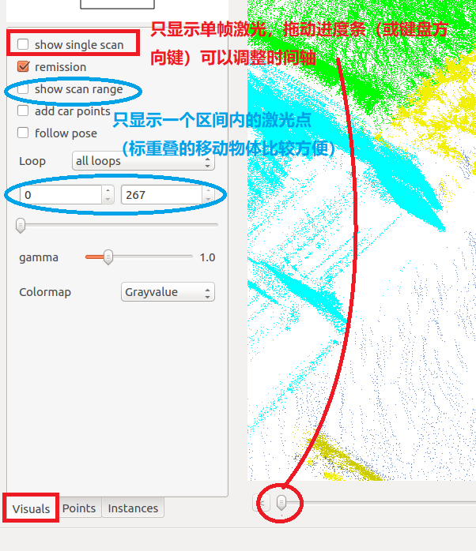

# SemanticPOSS标注流程

## 概述

本标注流程是在range image数据标注的基础上，利用point_labeler工具进行完善标注的过程。


## 标注环境准备 ##

1.  **GenerateSamplesForPointLabeler** : 将基于range image的标注结果，转化成可以被point_labeler读取的数据格式

   ```
   https://github.com/jsgaobiao/Generate_Samples_For_Point_Labeler
   ```

2. **Point Labeler**: SemanticKITTI团队开发的开源点云语义标注工具

   ```
   https://github.com/jbehley/point_labeler
   ```


## 数据准备

数据存放在ftp://poss.pku.edu.cn/local/POSS-V/3DLidarBbx/processdata路径下，共6段数据，请将需要标注的数据段下载到本地

1. **dsvl** : 包含点云数据和类别标签的二进制数据格式

2. **transproc.log**: 基于rangeimage的标注结果

3. **calib**: 标定参数文件，默认是P40n.calib

4. **colortable.txt**: 类别标签和可视化颜色的映射表

5. **bbox-all.log**: 数据段中所有instance物体的3D包围框信息（自动生成+少量人工矫正）


## 数据格式转换 ##

1. **编译GenerateSamplesForPointLabeler**，并在终端中运行

   ```bash
   ./GenerateSamplesForPointLabeler [*segn.dsvl] [transproc.log] [calib] [colortable] [output_dir] [bbox] [bbox_overwrite_flag]
   # 第一次转换数据时，bbox_overwrite_flag置1
   # 如果已经用point_labeler工具标注了部分点云，请将已标注的标签存入labels_bak文件夹中，并将bbox_overwrite_flag置0
   ```

   例如：第0段数据需要执行的命令为

   *./GenerateSamplesForPointLabeler 20190331133302_0-segn.dsvl 20190331133302_0-transproc.log P40n.calib colortable.txt data_for_point_labeler_0 20190331133302_0-bbx-all.log  1*

   将中括号中的参数替换为对应的内容，说明如下：

   [dsvl](required): 包含点云数据和类别标签的二进制数据格式，例如20190331133302_0-segn.dsvl
   [transproc.log](required): 基于rangeimage的标注结果，例如20190331133302_0-transproc.log
   [calib](default): 标定参数，默认是P40n.calib
   [colortable](default): 类别标签和可视化颜色的映射表，默认是colortable.txt
   [output_dir](default): 输入数据转换结果的文件夹，例如第0段数据是data_for_point_labeler_0
   [bbox](optional): （可选）3d的包围框，数据段中所有instance物体的3D包围框信息（自动生成+少量人工矫正），例如bbx-all.log
   [bbox_overwrite_flag](optional): （可选，和bbox参数同时存在，If bbox is not empty, must have this parameter.）该值为0表示保留labels_bak中的标签信息(labels_bak文件夹默认在output_dir下)，只覆盖包围框中的标签和instance id； 若该值为1则保留transproc中的标签和3d box中的标签和instance id


   **完成上述步骤后，在output_dir中（例如data_for_point_labeler_0）应该包括 :**

   (1) 文件夹：labels, tag, velodyne

   (2) 车辆位姿文件 poses.txt

   (3) calib.txt

2. **使用point_labeler程序进行标注**

   打开程序路径(例如/home/gaobiao/catkin_ws_labeler/src/point_labeler/bin) 

   1. **将labels.xml中的内容替换为SemanticPOSS对应的内容**

      在ftp://poss.pku.edu.cn/local/POSS-V/SemanticPOSS下

   2. **修改setting.cfg的设置，建议配置如下：（如果程序崩溃或内存不够，可以将tile size调小）**

      ```
      tile size: 150.0
      max scans: 200
      min range: 2.5
      max range: 80.0
      gpu memory: 4
      ```

   3. **执行标注程序**

   ```
   ./labeler
   ```

   4. **点击左上角，打开数据文件夹**

   5. **视角操作说明**

      |       说明       |                按键                |
      | :--------------: | :--------------------------------: |
      | 移动视角相机位置 |              W,A,S,D               |
      |     缩放视角     |              鼠标滚轮              |
      |   旋转相机视角   |          Ctrl + 鼠标右键           |
      |   升降相机视角   | Ctrl + 鼠标中键 （按住后移动鼠标） |

   6. 操作界面说明

      

      

      


# 数据标注顺序

在ftp://poss.pku.edu.cn/local/POSS-V/SemanticPOSS下，有对应步骤的视频教程

1. 打开百度街景，找到待标注的区域，熟悉待标注的场景
2. 先标注**建筑物**
3. 标注**植被**区域（一般是成片的绿化区，包括草坪和树木），基本原则是**由低到高标注**
   1. 先找到绿化区域中的特殊物体（例如：**路灯、标牌、石头**、**树干**等）进行标注，标注树干的时候使用remove ground过滤草坪，用remove with plane过滤树冠
   2. 用过滤器过滤区域中的**石头、树干、标牌**等类别，避免后续标注影响到这些类别
   3. 很多绿化区的**草坪**被自动标注为**路面**，先找到绿化区域的边界，再标注草坪区域和其中的植被
4. 标注**自行车停车场**区域
   1. 使用remove with plane 过滤掉有高度的物体，标注地面区域
   2. 用过滤器过滤**地面**激光点，标注**自行车**和**围栏**
5. 标注漏标的**路面**区域
   1. 用过滤器过滤掉**路面**标签，未标注的路面可以较明显的看出
   2. 使用remove with plane过滤掉有高度的物体，刚好露出待标注的**路面**，进行标注
6. 完善instance级别的物体（**人、骑车人、汽车**）
   1. 3D包围框的自动标注存在一些错误，需要检查并修复
   2. 重叠的运动的物体轨迹怎么办？
      1. 使用visuals标签页中的show scan range来辅助标注
      2. 使用visuals标签页中的show single scan来单帧标注（技巧：方向键前进后退，按住鼠标刷标签）


## 数据类型说明 ##

c-1-person  行人

c-2+person 多个行人（不用这个标签）

c-rider 骑自行车的人

board1  站在地上的方形标牌

board2  悬空的标牌（一般是道路指示牌）

board3  下面是细细的杆子的标牌

con-stone  锥桶/石头